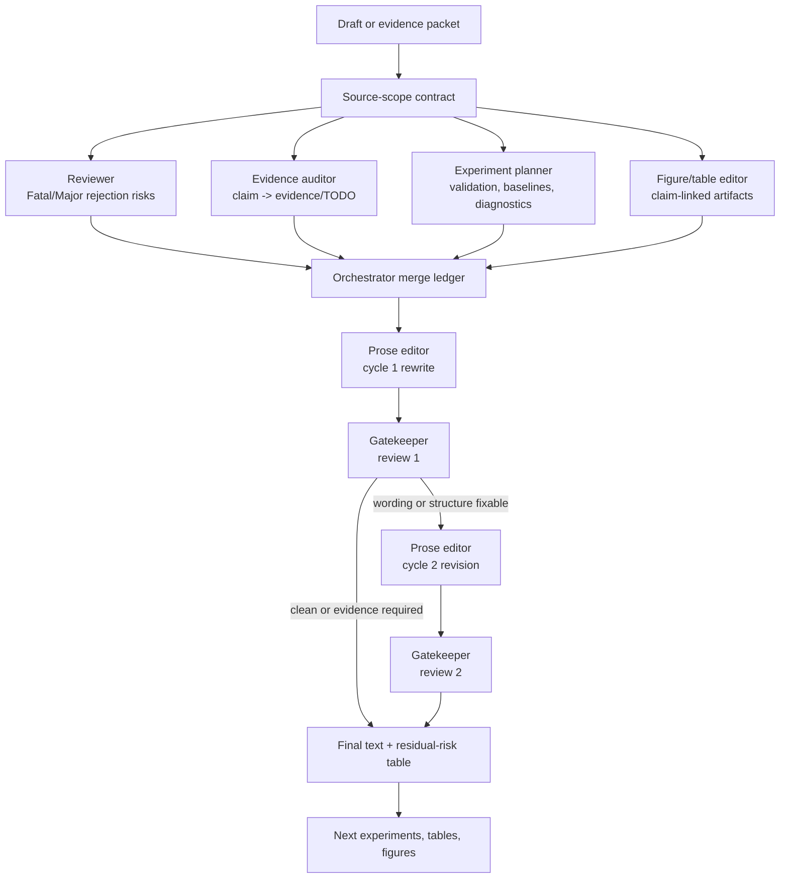

# CFD-AI Paper Skills

Agent skills for writing, reviewing, and hardening CFD-AI and scientific-ML papers with claim-evidence discipline.

## Pipeline Visualization

This package is built around reviewer-driven writing, not one-shot prose polishing.



Default loop limits:

- abstracts: max 2 edit-review cycles;
- longer sections/full drafts: max 3 edit-review cycles;
- stop early when remaining blockers require new evidence rather than wording.

## What This Is

This repository is a skill package for coding and research agents that work on manuscripts, reviews, LaTeX drafts, experiment plans, reproducibility audits, and reviewer responses in CFD-AI / SciML.

It is meant for papers involving neural operators, PINNs, surrogate modeling, turbulence closure, flow reconstruction, CFD acceleration, geometry-aware models, flow control, and related scientific-ML workflows.

The package gives an agent domain-specific instructions, references, rubrics, examples, and templates so it can produce useful paper artifacts instead of generic academic prose.

## Why CFD-AI Papers Need This

CFD-AI manuscripts are easy to overstate. A model can look good on a random snapshot split while failing on held-out Reynolds numbers, geometry, mesh, boundary conditions, long rollouts, force coefficients, spectra, or coupled-solver stability. A polished paragraph is not enough.

This package pushes the agent to ask the questions reviewers ask:

- What physical problem is actually being solved?
- What claim is supported by which evidence?
- Which solver, mesh, split, baseline, metric, and diagnostic are known?
- Which facts are missing and must stay `TODO`?
- Which claims need weaker wording?
- Which figures and tables prove the story?
- Can the LaTeX artifact be built and checked?

## Agent Behaviors

| Behavior | What the agent should do |
|---|---|
| Claim-evidence discipline | Map every major claim to evidence, limitation, or `TODO`. |
| CFD-native vocabulary | Use terms such as regime, nondimensional group, mesh, BC/IC, QoI, spectra, residual, closure, and coupled solver correctly. |
| Numerical reproducibility | Ask for solver, grid, boundary/initial conditions, seeds, splits, baselines, hardware, and runtime. |
| Reviewer-risk detection | Flag overclaims such as "generalizable", "real-time", "physically consistent", "state-of-the-art", or "solves turbulence" when evidence is absent. |
| LaTeX/PDF production | Produce build-ready LaTeX when requested and keep compile/build notes explicit. |
| Review-paper taxonomy | Organize related work by workflow role, validation axis, and evidence level rather than citation order. |
| Benchmark-aware validation | Separate random splits from held-out time, Reynolds number, geometry, mesh, BC/IC, and coupled-solver validation. |

## Installation And Quickstart

### 1. Clone and validate

```bash
git clone https://github.com/VortexyAether/cfd-ai-paper-skills.git
cd cfd-ai-paper-skills
python3 scripts/validate_package.py
python3 scripts/run_static_evals.py
python3 scripts/export_package.py --dry-run
```

The deterministic checks require only Python. Tectonic is needed only when you want to compile LaTeX benchmark artifacts.

### 2. Use directly with Codex native subagents

Start Codex from the package root so project-scoped agents under `.codex/agents/` are visible:

```bash
codex
```

Then paste a prompt template:

```text
.codex/prompts/smoke-test.md
.codex/prompts/iterative-edit-review-loop.md
.codex/prompts/multi-agent-abstract-rescue.md
.codex/prompts/full-paper-reviewer-editor.md
```

Minimal Codex prompt:

```text
Use native Codex subagents and run a bounded edit-review loop.
Spawn cfd_reviewer, evidence_auditor, experiment_planner, and figure_table_editor in parallel on this abstract.
Wait for all. Merge their outputs into a blocker ledger.
Run prose_editor -> gatekeeper -> prose_editor -> gatekeeper for max 2 cycles.
Stop if no Fatal/Major blockers remain or remaining blockers need new evidence.

<Abstract here>
```

Use `/agent` inside Codex CLI to inspect active subagent threads.

### 3. Use as a local skill package

Point any local-file-capable agent at the repository and start with the root `SKILL.md` router, or name focused files under `skills/<skill-name>/SKILL.md`.

If your environment supports local reusable skills, copy or symlink the whole repository intact so the router can load `references/`, `rubrics/`, `examples/`, `templates/`, and `.codex/`:

```bash
mkdir -p ~/.hermes/skills/research
ln -s "$PWD" ~/.hermes/skills/research/cfd-ai-paper-skills
hermes skills list | grep cfd-ai-paper-skills
```

Example generic prompt:

```text
Use the CFD-AI paper skills in this repository. Audit my draft for unsupported CFD/SciML claims, map every major claim to evidence or TODO, and rewrite only the unsafe claims. Do not invent solver settings, citations, DOI values, or benchmark numbers.
```

`SKILL.md` routes manuscript writing, claim audits, reproducibility checks, experiment design, related-work synthesis, LaTeX production, reviewer-response work, and multi-agent reviewer-editor loops to the focused subskills under `skills/`.

## Codex Usage Tutorial

From a workspace that contains this package, ask Codex to use the skill directly:

```text
Use SKILL.md from the CFD-AI paper skills package as the router.
Use skills/paper-claim-auditor/SKILL.md and skills/cfd-reproducibility-checker/SKILL.md.
Review manuscript/main.tex and produce:
1. a claim-evidence table,
2. a CFD reproducibility checklist,
3. reviewer-risk rewrites for unsupported claims.
Mark unknown facts as TODO.
```

For a full LaTeX seed:

```text
Use skills/related-work-synthesis/SKILL.md, skills/figure-and-result-storytelling/SKILL.md, and skills/latex-paper-production/SKILL.md.
Create a review-paper LaTeX seed on geometry-aware neural operators for CFD.
Use only the evidence packet I provide.
Include taxonomy tables, figure placeholders, reviewer traps, and TODO bibliography entries.
```

Codex can also run the repository checks:

```bash
python3 scripts/validate_package.py
python3 scripts/run_static_evals.py
python3 scripts/export_package.py --dry-run
```

## Claude Code / Claude-Like Usage

Do not rely on a platform-specific install command unless your Claude-like environment documents one. The portable pattern is to give the agent the repository path and name the skill files it should follow.

Example prompt:

```text
You have access to this repository:
/path/to/cfd-ai-paper-skills

Follow:
- skills/scientific-journal-writing/SKILL.md
- skills/sciml-experiment-auditor/SKILL.md
- skills/cfd-reproducibility-checker/SKILL.md

Task: turn my rough CFD-AI experiment notes into a reviewer-safe manuscript outline and experiment matrix. Use TODO for missing solver, mesh, split, baseline, runtime, and citation facts.
```

If your environment supports reusable skills, copy or symlink the whole repository according to that environment's own instructions. Keep the root package intact so skill files can load `references/`, `rubrics/`, `examples/`, and `templates/`.

## Generic Agent Usage

Any capable agent can use this package if it can read local files. Give it:

- the package path;
- the specific skill files to follow;
- the manuscript or evidence packet;
- the artifact you want;
- a hard rule not to invent missing scientific facts.

Minimal prompt:

```text
Use /path/to/cfd-ai-paper-skills as a local instruction package.
Follow skills/cfd-ml-paper-reviewer/SKILL.md.
Review my CFD-AI draft as a skeptical journal reviewer.
Return major issues first, then a claim-evidence table, then concrete revision tasks.
Unknown facts must remain TODO.
```

## Copy-Paste Tasks

```text
Build a claim-evidence map for this abstract and introduction. For each claim, list evidence, missing evidence, reviewer risk, and safer wording.
```

```text
Audit this CFD-AI experiment plan. Check train/test split, held-out regime, mesh sensitivity, baselines, physical diagnostics, uncertainty, runtime, and reproducibility.
```

```text
Turn this citation dump into a review-paper taxonomy. Organize by CFD workflow role first, ML method family second, and validation axis third.
```

```text
Create a LaTeX mini-review seed from this evidence packet. Include tables, boxed figure placeholders, reviewer traps, TODO bibliography entries, and limitation boundaries.
```

```text
Draft a response-to-reviewers table. For each reviewer point, identify evidence needed, manuscript location, proposed change, and response text.
```

## Recommended Workflows

| Workflow | Start with | Use these skills |
|---|---|---|
| Draft safety audit | Abstract, intro, or full draft | `paper-claim-auditor`, `cfd-ml-paper-reviewer` |
| Experiment hardening | Method notes and results | `experiment-design-for-sciml`, `sciml-experiment-auditor`, `cfd-reproducibility-checker` |
| Related-work positioning | Citation dump or topic | `related-work-cartographer`, `related-work-synthesis` |
| Figure/story pass | Current figures or planned results | `figure-and-result-storytelling`, `paper-claim-auditor` |
| LaTeX paper production | Evidence packet and desired structure | `scientific-journal-writing`, `latex-paper-production` |
| Revision management | Reviews and manuscript diff | `paper-revision-loop-manager`, `response-to-reviewers` |

## Benchmarks And Examples

The `evaluation/tasks/` directory contains prompt-style benchmark tasks that users can run manually with an agent. They are useful examples of the package's expected behavior:

- `cfd-ai-trend-review-manuscript-benchmark.md`: review-paper seed for geometry-aware neural operators and mesh graph surrogates.
- `cfd-ai-closure-review-benchmark.md`: turbulence closure review seed focused on a priori vs a posteriori evidence.
- `cfd-ai-benchmark-landscape-review.md`: benchmark landscape review focused on validation axes, splits, failure modes, and reproducibility.
- `cfd-ai-full-manuscript-generation-benchmark.md`: full mini-manuscript generation from a bounded evidence packet.

The `examples/` directory shows smaller before/after transformations for abstracts, experiment plans, related-work taxonomies, reviewer comments, and AI-ish prose.

## Limitations

- This package does not verify scientific facts by itself. The agent must be given evidence or mark facts as `TODO`.
- It does not replace domain review by CFD/SciML experts.
- It does not guarantee LaTeX compilation in every journal template.
- It does not provide official installation commands for every agent platform.
- It should not invent solver settings, DOI values, author roles, benchmark scores, dataset licenses, or citation metadata.

## Related Projects

General AI research-writing skill projects are useful references for evidence-backed paper workflows, prompt routing, claim maps, citation checks, and build packaging. This package differs by focusing on CFD-AI and SciML reviewer risks: mesh/regime/split design, solver coupling, turbulence closure, reconstruction diagnostics, geometry generalization, and numerical reproducibility.

CFD-AI resource lists are useful for landscape coverage, but they are not substitutes for claim-evidence auditing or benchmark design. This package treats those lists as source material for taxonomy and validation prompts, not as proof that a manuscript claim is true.

## Repository Layout

```text
skills/       Focused agent skills.
references/   Domain notes, benchmark landscape, source-scope references, style guidance.
rubrics/      Scoreable review and evaluation rubrics.
examples/     Small before/after examples.
templates/    Reusable paper/review artifacts.
evaluation/   Benchmark tasks, static evals, and run artifacts.
scripts/      Validators, deterministic LaTeX surface checks, export helper.
docs/         User tutorials and positioning notes.
```

## Validation

From the package root:

```bash
python3 scripts/validate_package.py
python3 scripts/run_static_evals.py
python3 scripts/export_package.py --dry-run
PYTHONPYCACHEPREFIX=.tmp_pycache python3 -m py_compile scripts/*.py
rm -rf .tmp_pycache
```
